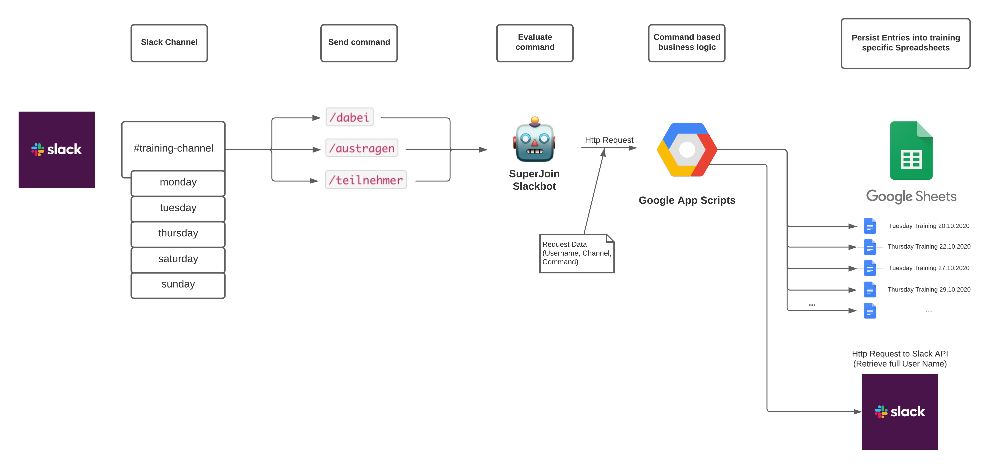

# superjoin

## The Slack message structure

Example payload of a command post message can be found under [example_request.json](doc/example_request.json).

## Software Components and external API calls

